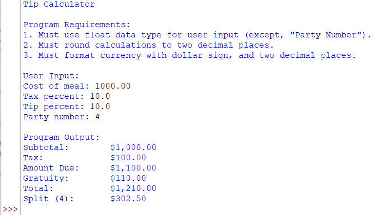
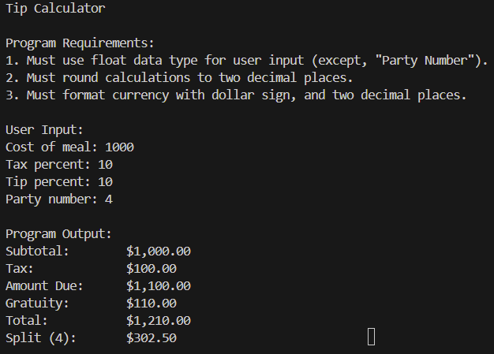
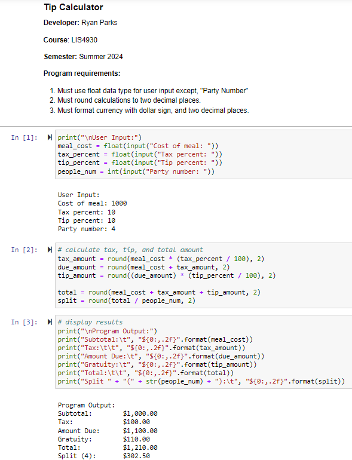

> **NOTE:** This README.md file should be placed at the **root of each of your repos directories.**
>
>Also, this file **must** use Markdown syntax, and provide project documentation as per below--otherwise, points **will** be deducted.
>

# LIS4930

## Ryan Parks

### Assignment #1 Requirements:

*Four Parts:*

1. Distributed Version Control with Git and Bitbucket
2. Development Installations
3. Questions
4. Screenshots of a1_tip_calculator application

#### README.md file should include the following items:

* Screenshot of a1_tip_calculator application running in IDLE
* Screenshot of a1_tip_calculator application running in Visual Studio Code
* Screenshot of a1_tip_calculator application running in Jupyter Notebook
* Upload and link to A1 .ipynb file: [tip_calculator.ipynb](a1_tip_calculator/tip_calculator.ipynb "A1 Jupyter Notebook")
* git commands w/short descriptions

> This is a blockquote.
> 
> This is the second paragraph in the blockquote.
>
> #### Git commands w/short descriptions:

1. git init - creates a new git repository
2. git status - displays the state of the current working directory
3. git add - adds a change from the working directory to the staging area
4. git commit - creates a "snapshot" of the project's current changes, allows for a message using -m
5. git push - uploads local repository files or changes to remote repository online
6. git pull - fetches and downloads content from a remote repository to your local repository
7. git remote -v - checks the connection to your remote repository and displays it back to you

#### Assignment Screenshots:

*Screenshot of a1_tip_calculator application running (IDLE):*

*Screenshot of a1_tip_calculator application running (VS Code)*:

*A1 Jupyter Notebook*:

#### Tutorial Links:

*Bitbucket Tutorial - Station Locations:*
[A1 Bitbucket Station Locations Tutorial Link](https://bitbucket.org/rmp21gfsu/bitbucketstationlocations/ "Bitbucket Station Locations")