> **NOTE:** This README.md file should be placed at the **root of each of your repos directories.**
>
>Also, this file **must** use Markdown syntax, and provide project documentation as per below--otherwise, points **will** be deducted.
>

# Artificial Intelligence Applications

## Ryan Parks

### Assignment #3 Requirements:

*Three Parts:*

1. Examining, sorting, shaping, analyzing, and displaying data sets
2. Provide screenshots of jupyter notebook
3. Include link to a3 ipynb file

#### README.md file should include the following items:

* Screenshots of A3 running in jupyter notebook
* Upload and link to A3 .ipynb file: [a3.ipynb](a3.ipynb "A3 Jupyter Notebook")

> This is a blockquote.
> 
> This is the second paragraph in the blockquote.
>

#### Assignment Screenshots:

*Screenshots of A3 running in jupyter notebook & skillsets 4-6:*

| 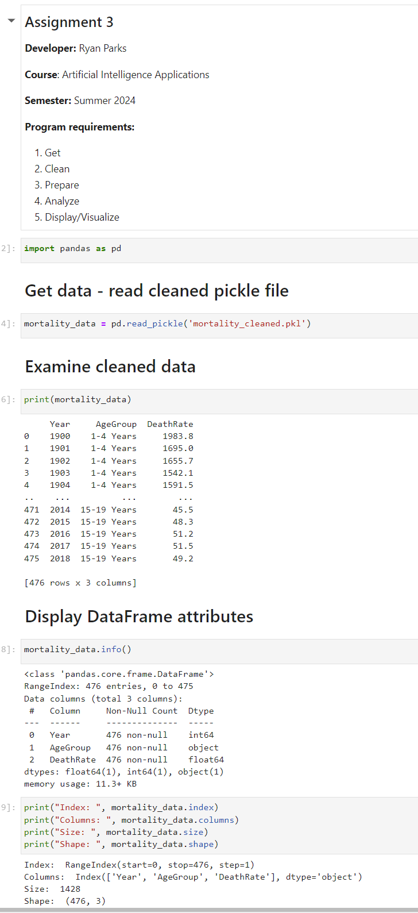 | 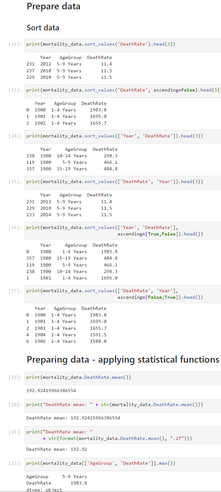 |
|:-----------------------------------------:|:-----------------------------------------:|
| 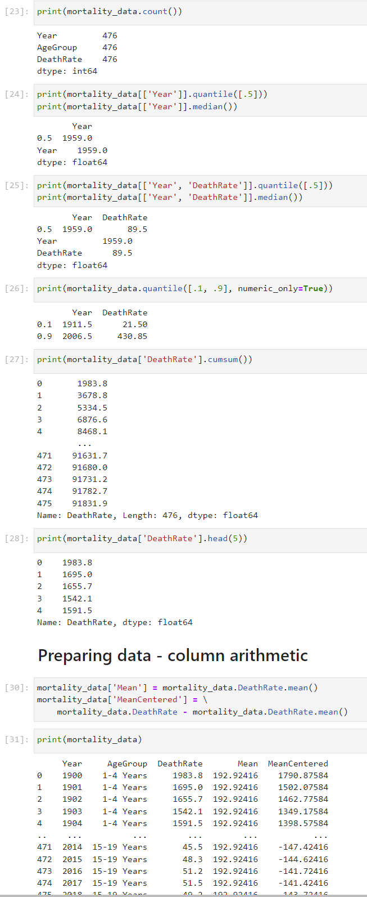 | 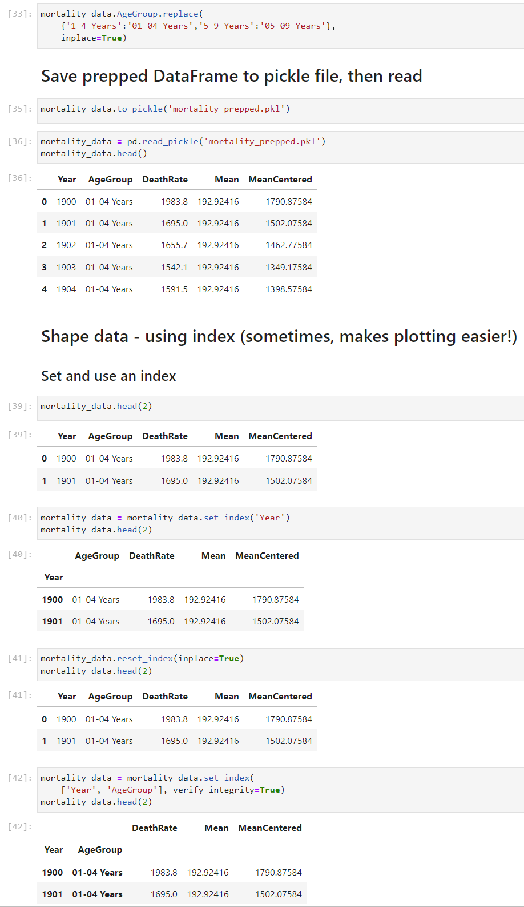 |
| 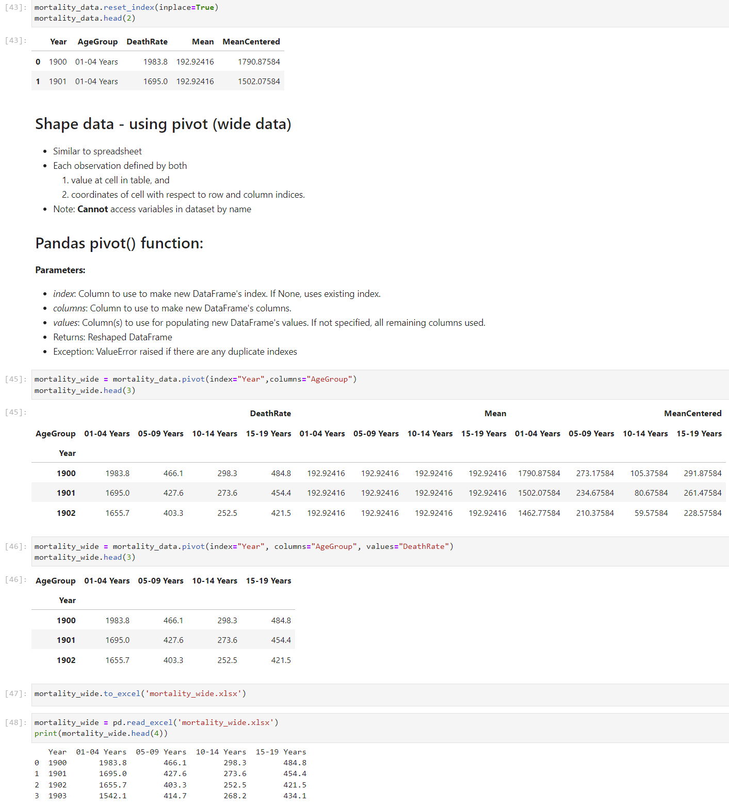 | 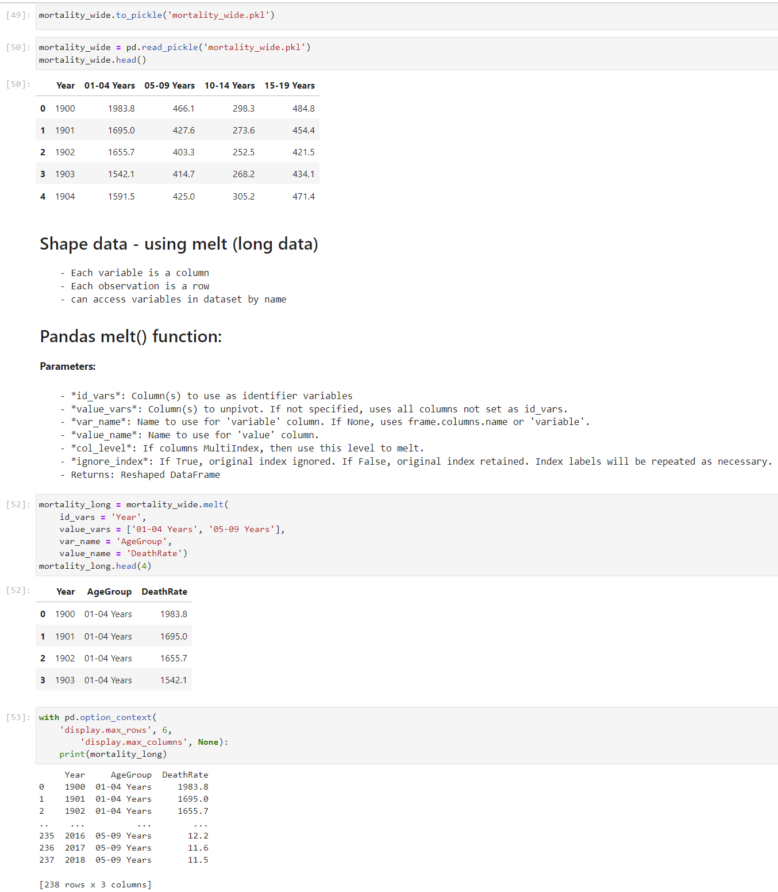 |
| 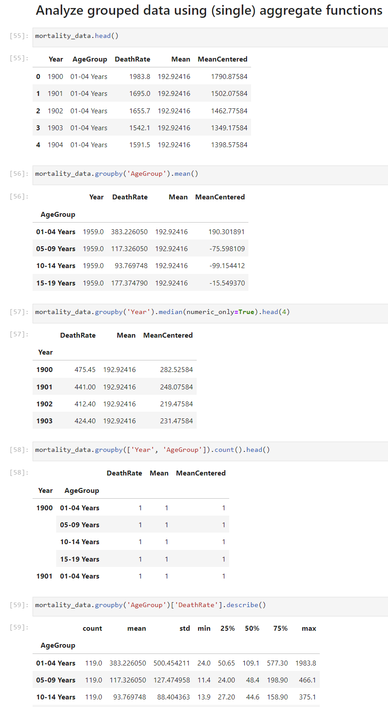 | 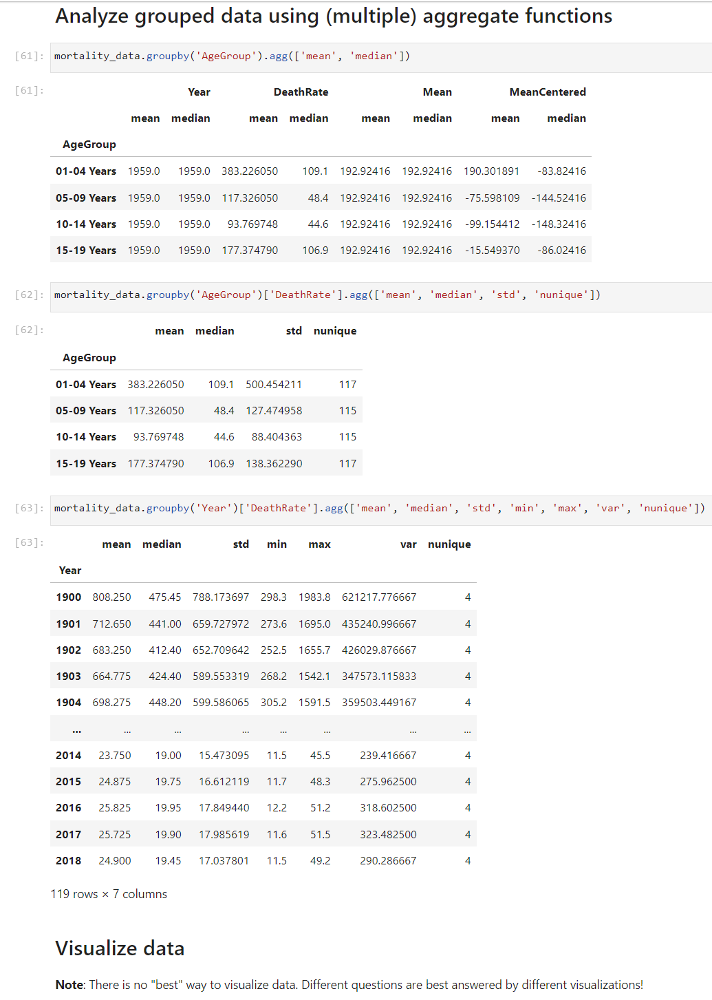 |
| 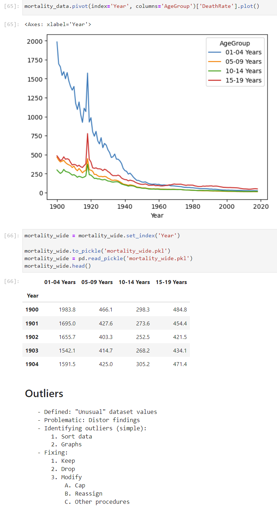 | 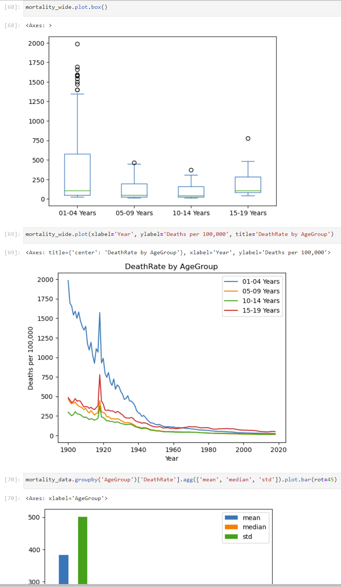 |
| 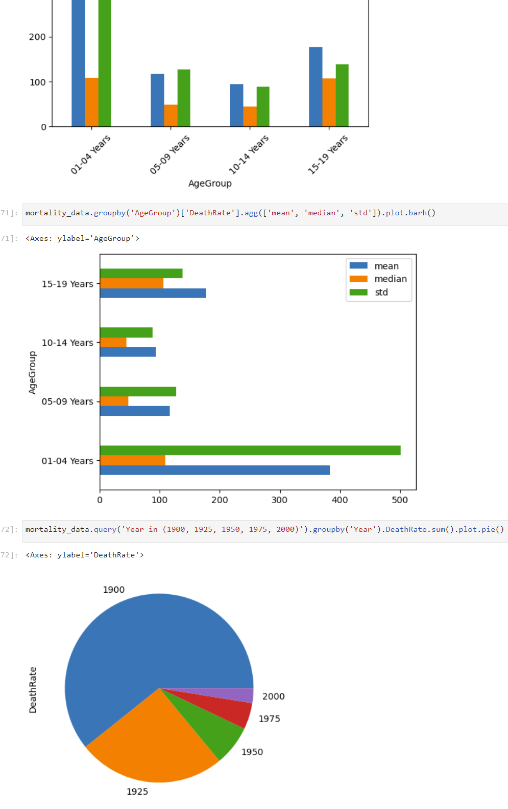 | 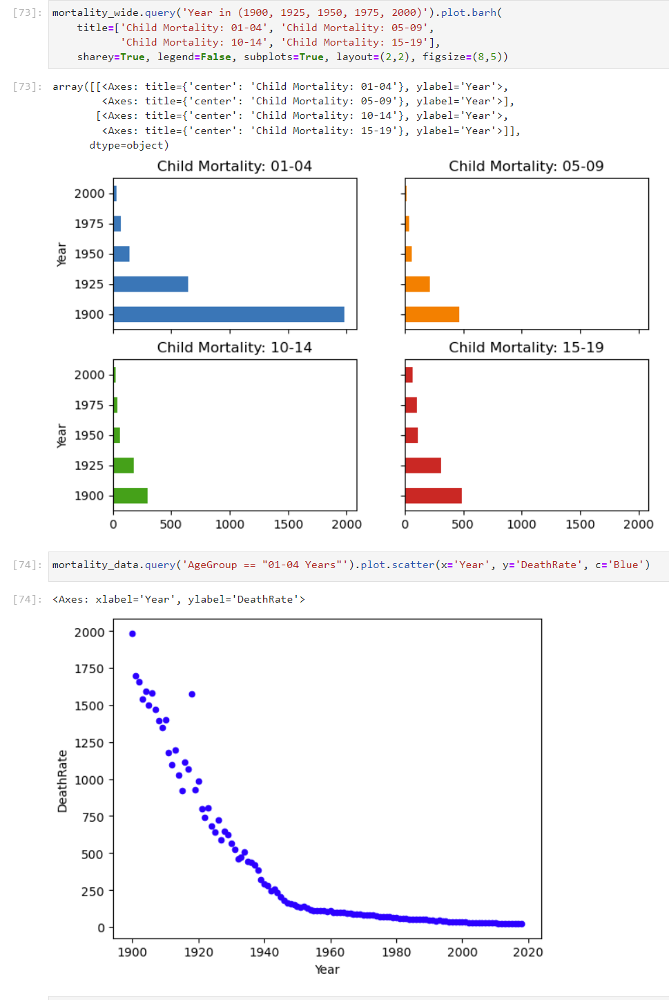 |
| 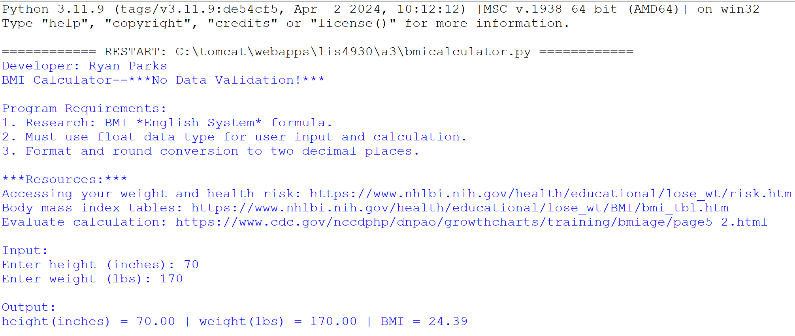 | 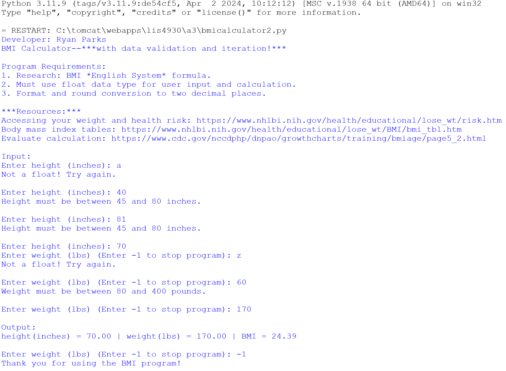 |
| 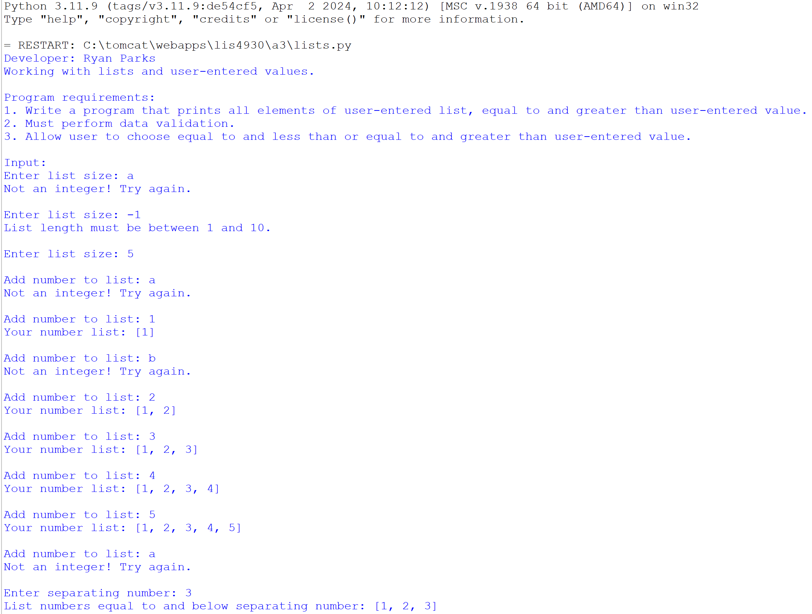 |