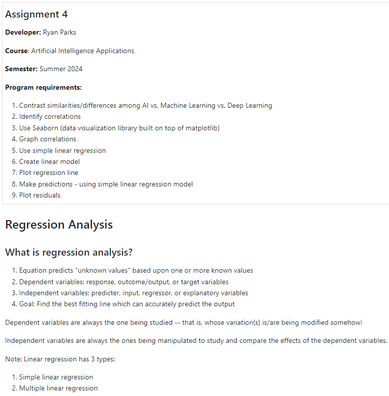
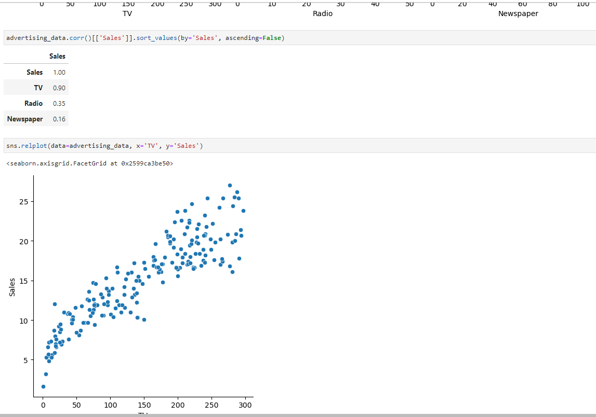

> **NOTE:** This README.md file should be placed at the **root of each of your repos directories.**
>
>Also, this file **must** use Markdown syntax, and provide project documentation as per below--otherwise, points **will** be deducted.
>

# Artificial Intelligence Applications

## Ryan Parks

### Assignment #4 Requirements:

*Nine Parts:*

1. Contrast similarities/differences among AI vs. Machine Learning vs. Deep Learning
2. Identify correlations
3. Use Seaborn (data visualization library built on top of matplotlib)
4. Graph correlations
5. Use simple linear regression
6. Create linear model
7. Plot regression line
8. Make predictions - using simple linear regression model
9. Plot residuals

#### README.md file should include the following items:

* Screenshots of A4 running in jupyter notebook
* Upload and link to A4 .ipynb file: [a4.ipynb](a4.ipynb "A4 Jupyter Notebook")

> This is a blockquote.
> 
> This is the second paragraph in the blockquote.
>

#### Assignment Screenshots:

*Screenshots of A4 running in jupyter notebook & skillsets 10-12:*

|  |  |
|:-----------------------------------------:|:-----------------------------------------:|
|  |  |
|  |  |
|  |  |
|  |  |
|  |  |
|  |  |
|  |