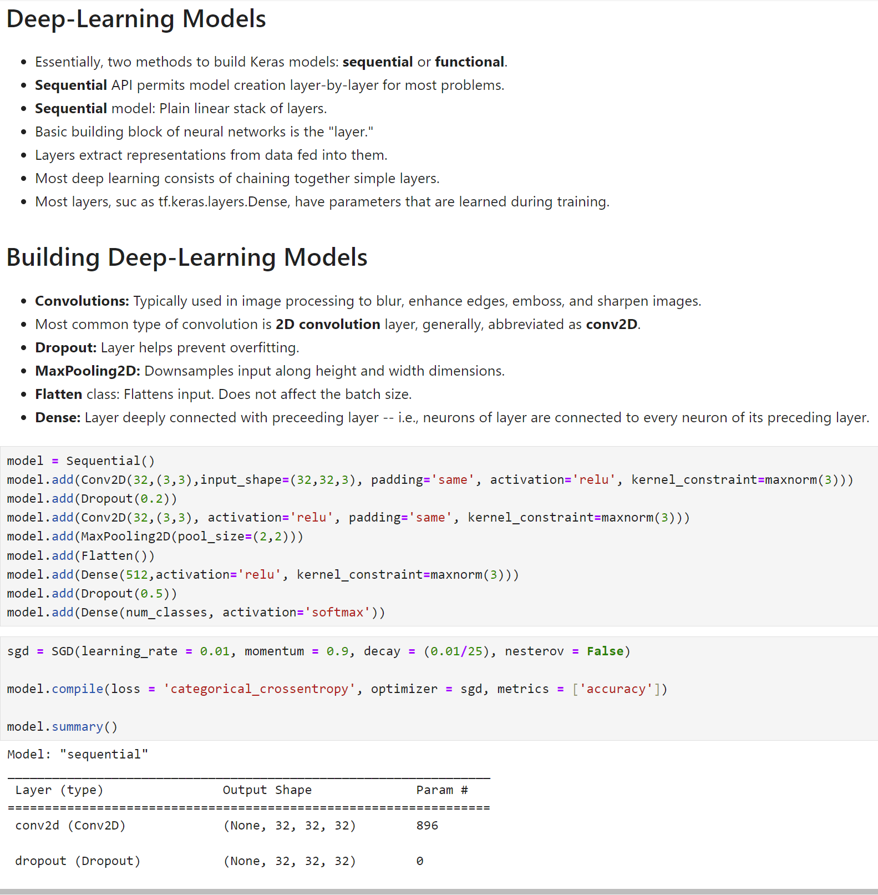

> **NOTE:** This README.md file should be placed at the **root of each of your repos directories.**
>
>Also, this file **must** use Markdown syntax, and provide project documentation as per below--otherwise, points **will** be deducted.
>

# Artificial Intelligence Applications

## Ryan Parks

### Project #2 Requirements:

*Six Parts:*

1. Describe 'Deep Learning'
2. Describe 'Neural Networks'
3. Install necessary modules/packages
4. Import required dataset
5. Analyze images
6. Build and train *convolution neural network* **(CNN)** to classify images

#### README.md file should include the following items:

* Screenshots of P2 running in jupyter notebook
* Link to P2 .ipynb file: [p2.ipynb](p2.ipynb "P2 Jupyter Notebook")
* Screenshot of conda environments: 
* Link to exported lis4930 conda environment package list file: [LIS4930 Package List](lis4930_package_list.txt "LIS4930 Package List")

> This is a blockquote.
> 
> This is the second paragraph in the blockquote.
>

#### Assignment Screenshots:

*Screenshots of P2 running in jupyter notebook:*

|  |  |
|:-----------------------------------------:|:-----------------------------------------:|
|  |  |
|  |  |
|  |  |
|  |  |
|  |  |
|  |  |

*Debugging Example Screenshot:*

